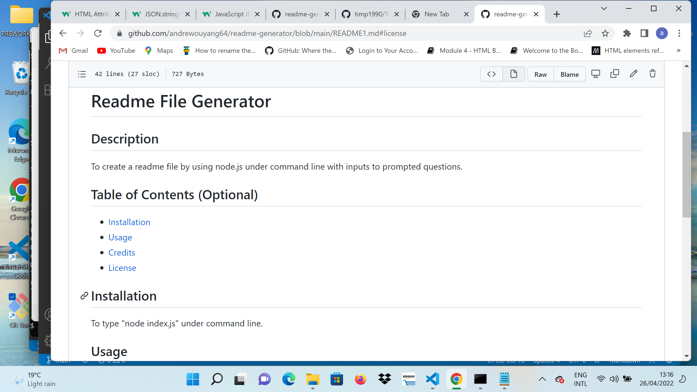

# Readme File Generator

## Description
To use node.js to create a readme file by giving inputs to the prompted questions in command line console.

## Table of Contents (Optional)

- [Installation](#installation)
- [Usage](#usage)
- [Credits](#credits)
- [License](#license)

## Installation
To run npm install, then execute the app by typing "node index.js".

## Usage
To generate a professional readme file automactically by just answering prompted questions.

## Credits
Andrew Ouyang, Javascript, node.js and Trilogy

## License
MIT

[]

Please see the license condition: 
(https://opensource.org/licenses/MIT)

## How to Contribute
Please refer to Contributor Convenant

My email: 
andrew.ouyang@hotmail.com

## Github username
andrewouyang64

## Tests
None